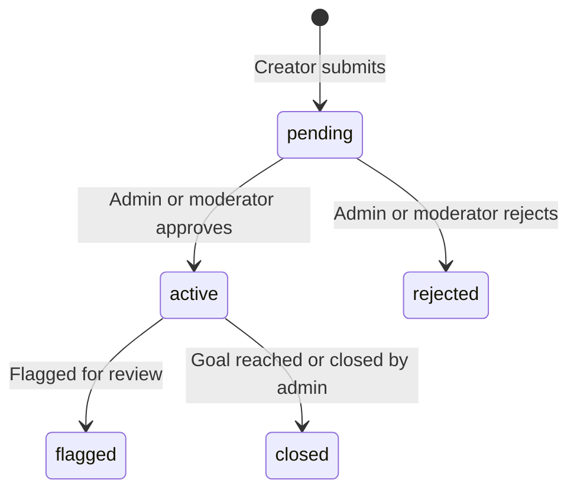
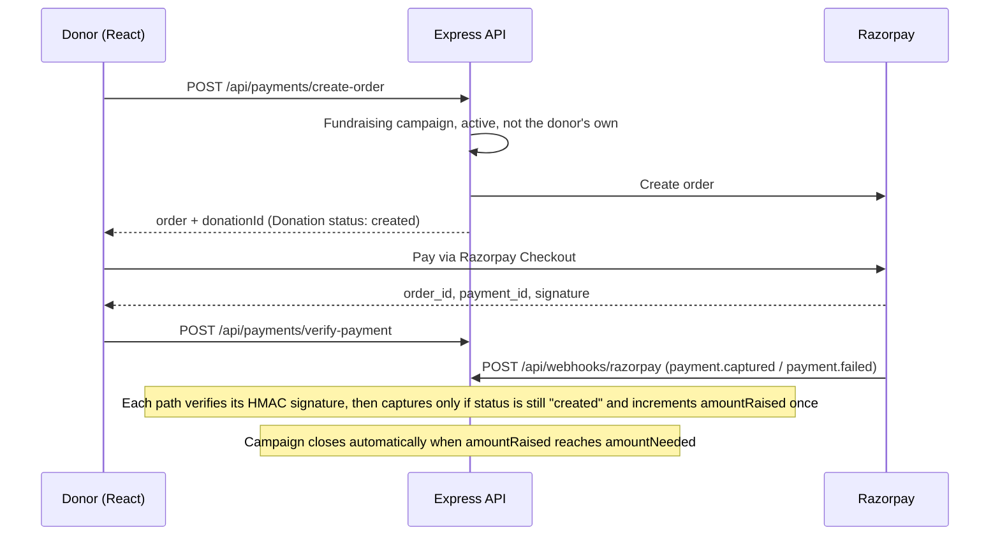

<div align="center">

# Utthan · उत्थान

**Crowdfunding and cause participation for India. Donate money, pledge goods, or show up.**


</div>

---

## About

*Utthan* (उत्थान) is Hindi for "upliftment". It is a full-stack MERN platform where people can start and support causes in three different ways, all under one roof:

| Campaign type | What supporters do | How progress is tracked |
| --- | --- | --- |
| **Fundraising** | Donate money through Razorpay | Amount raised vs. goal |
| **Participation** | Join an event such as "Run for a Cause" | Participant headcount vs. target |
| **Goods donation** | Pledge in-kind items (food, clothes, books, etc.) | Items received vs. items needed |

Every architectural decision in this project is deliberate and documented below, from the payment flow to the auth model. See [Key design decisions](#key-design-decisions).

> **Status:** actively under development. The backend API is feature-complete for the core flows; the frontend currently covers auth, campaign discovery, campaign detail and campaign creation, with checkout and dashboards next. See [Project status](#project-status).

**Live demo:** coming soon.

## Features

**Working today**

- **Accounts:** signup, login, logout, forgot and reset password (emailed, 10-minute single-use token), profile update, password change and account deletion
- **Roles:** `user`, `moderator` and `admin`, enforced with composable middleware
- **Campaigns:** three types on one model, ten categories, cover image plus gallery, GeoJSON location with address, SEO-friendly slug URLs, soft delete with owner and admin permissions
- **Moderation:** new campaigns start as `pending` and go through an admin/moderator approval workflow (approve, reject, flag, close, restore)
- **Discovery:** filter by type and category, sort, paginate, and limit fields; filters are synced to the URL on the frontend
- **Payments:** Razorpay orders, HMAC signature verification and a signed webhook, with idempotent confirmation
- **Goods donations:** pledge, edit, cancel and mark collected; pledges are validated against the quantity still needed
- **Participation:** join and leave with one entry per user, a participant cap, and a creator view of participants
- **Image uploads:** JPEG, PNG, WebP or GIF up to 5 MB
- **Create-campaign flow:** type-specific form with validation (react-hook-form + zod), image upload and a Leaflet map picker with address search
- **Security layers:** Helmet, credentialed CORS, rate limiting, NoSQL-injection sanitization, XSS sanitization, HTTP parameter pollution protection, request size limits and centralized error handling
- **UI:** responsive, light and dark themes, accessible component primitives

**In progress and planned**

- Donation checkout, join and pledge actions in the UI (the Razorpay Checkout SDK is already loaded)
- User dashboard and admin panel
- Nearby-campaign discovery using MongoDB geospatial queries
- Live campaign progress over WebSockets
- AI-assisted verification of campaign documents with Gemini Vision
- Campaign auto-tagging and a personalized feed

## Tech stack

| Layer | Technologies |
| --- | --- |
| **Frontend** | React 19, Vite, JavaScript, Tailwind CSS v4, shadcn/ui (Base UI primitives, Nova preset, Geist font), React Router, Axios, react-hook-form + zod, Leaflet / react-leaflet, date-fns, Sonner, Oxlint |
| **Backend** | Node.js, Express 5, MongoDB with Mongoose 9, JWT in httpOnly cookies, bcryptjs, multer, Nodemailer (Mailtrap in development), ESLint, Prettier |
| **Payments** | Razorpay (orders, HMAC verification, webhooks) |
| **Planned** | Google Gemini Vision, Socket.io (dependency installed), MongoDB `2dsphere` queries with Haversine distance |

## Campaign lifecycle



Only `active` campaigns accept donations, pledges and participants. The public listing shows `active` and `closed` campaigns. A soft-deleted campaign that an admin restores returns to `pending`.

## How a donation works

The client-side verify call gives the donor instant feedback, and Razorpay's server-to-server webhook is the safety net if the browser never reports back. Both paths verify an HMAC signature and only act on a donation that is still in the `created` state, so whichever arrives first confirms the payment and the other is ignored.



## Key design decisions

- **One User model for everyone.** Donors and campaign creators are the same account. Relationships live on `Campaign.creator` and `Donation.donor`, so someone is a "fundraiser" or a "donor" purely by activity, not by a stored label.
- **One Campaign model, three types.** A `type` field (`fundraising`, `participation`, `goods-donation`) switches which fields are required (`amountNeeded`, `participantGoal` or `items`), and virtual fields expose progress for each type.
- **Idempotent, signature-verified payments.** Razorpay signatures are checked with HMAC on both confirmation paths, the webhook verifies the raw request body, and status guards prevent double-counting.
- **Cookie-based auth.** The JWT is issued as an httpOnly cookie (`Secure` in production). The React client never reads, stores or forwards the token, which removes the usual XSS token-theft path. Signup ignores any client-supplied role, and changing a password invalidates older tokens.
- **Composable RBAC.** `protect` and `requireRole(...)` middleware compose per route, so permissions are declared where the route is defined instead of being scattered through controllers.
- **Razorpay as the sole gateway.** Chosen for INR-first support and UPI.
- **Slugs for public URLs, ObjectIds internally.** A slug is generated once at creation and never changes, so shared links survive title edits. Duplicate titles get a numeric suffix.
- **Soft deletes.** Campaigns and users are flagged rather than removed, and admins can restore or permanently delete.
- **Geo-ready schema.** Campaign locations are GeoJSON points with a `2dsphere` index, ready for nearby search.
- **Planned AI trust scorer.** Category-specific document verification with Gemini Vision: extract structured fields from an uploaded document, cross-validate them against the campaign's claims, and produce an authenticity confidence score.

## Project structure

```
Utthan/
├── backend/
│   ├── app.js                 # middleware stack and route mounting
│   ├── server.js              # DB connection and server start
│   ├── config/                # Razorpay client, .env.example
│   ├── controllers/           # auth, user, campaign, donation, goods donation,
│   │                          # participation, payment + webhook, upload, admin, errors
│   ├── middleware/            # auth (protect, requireRole), upload (multer)
│   ├── models/                # User, Campaign, Donation, GoodsDonation, Participation
│   ├── routes/
│   ├── scripts/               # dev utilities (approve campaigns, backfill slugs, test signatures)
│   ├── uploads/               # locally stored images (git-ignored)
│   └── utils/                 # ApiFeatures, AppError, email, helpers
├── frontend/
│   ├── index.html             # loads the Razorpay Checkout SDK
│   └── src/
│       ├── api/               # Axios client and API modules
│       ├── components/        # auth, campaigns, dashboard, home, layout, feedback, ui
│       ├── context/           # AuthContext
│       ├── pages/
│       ├── utils/             # API error normalization
│       └── router.jsx
├── LICENSE
└── README.md
```

## API overview

All routes are prefixed with `/api`. Everything except the public routes needs a valid auth cookie.

| Area | Base path | Endpoints |
| --- | --- | --- |
| Users | `/users` | `POST /signup` `/login` `/logout` `/forgotPassword` · `PATCH /resetPassword/:token` · `GET /me` · `PATCH /updateMe` `/updatePassword` · `DELETE /deleteMe` |
| Campaigns | `/campaign` | `GET /` (public) · `POST /` · `GET /my-campaigns` · `GET /:slug` (public) · `PATCH /:slug` · `DELETE /:slug` |
| Campaign sub-resources | `/campaign/:slug` | `POST /join` · `DELETE /leave` · `GET /participants` (creator or admin) · `GET /donations` (creator or admin) |
| Donations | `/donations` | `GET /me` · `GET /:id` · `GET /admin` (admin, moderator) |
| Payments | `/payments` | `POST /create-order` · `POST /verify-payment` |
| Webhook | `/webhooks/razorpay` | `POST` (signature-verified, raw body) |
| Goods donations | `/goods-donations` | `POST /campaigns/:slug` · `GET /my` · `GET /campaigns/:slug` · `GET /:id` · `PATCH /:id` · `PATCH /:id/cancel` · `PATCH /:id/collect` |
| Uploads | `/upload` | `POST /` (multipart field `image`) |
| Admin: campaigns | `/admin/campaigns` | `GET /` `/active` `/pending` `/flagged` `/deleted` `/:id` · `PATCH /:id/approve` `/reject` `/flag` `/close` `/restore` · `DELETE /:id` |
| Admin: users | `/admin/users` | `GET /` `/deleted` `/:id` · `PATCH /:id/role` `/recover` · `DELETE /:id` |

The listing endpoints accept `type`, `category`, `sort` (comma-separated, `-` for descending), `fields`, `page`, `limit` (max 100) and comparison operators such as `amountNeeded[gte]=5000`.

## Getting started

### Prerequisites

- Node.js 20.19 or newer (22.12+ also works), as required by Vite 8 and Mongoose 9
- A MongoDB database (Atlas or local)
- Razorpay **test-mode** API keys
- A Mailtrap sandbox inbox for password-reset emails

### 1. Clone

```bash
git clone https://github.com/Shivadeep-Kathail/Utthan.git
cd Utthan
```

### 2. Backend

```bash
cd backend
npm install
cp config/.env.example config.env    # the server reads backend/config.env (git-ignored)
npm start                            # nodemon server.js
```

Fill in `config.env`:

```env
NODE_ENV=development
PORT=8080

# MongoDB: <PASSWORD> in the URL is replaced with DATABASE_PWD at startup
DATABASE=mongodb+srv://<user>:<PASSWORD>@<cluster>.mongodb.net/utthan
DATABASE_PWD=<your-db-password>

# JWT auth (JWT_COOKIE_EXPIRY is in days)
JWT_SECRET_KEY=<long-random-string>
JWT_EXPIRY=90d
JWT_COOKIE_EXPIRY=90

# Mailtrap sandbox
EMAIL_HOST=
EMAIL_PORT=
EMAIL_USERNAME=
EMAIL_PASSWORD=

# Razorpay (test mode)
RAZORPAY_KEY_ID=
RAZORPAY_KEY_SECRET=
RAZORPAY_WEBHOOK_SECRET=
```

### 3. Frontend

```bash
cd frontend
npm install
cp .env.example .env
npm run dev                          # http://localhost:8081
```

```env
VITE_API_BASE_URL=http://localhost:8080/api
```

> The frontend runs on port **8081** and the backend's CORS is configured for `http://localhost:8081` with credentials, so keep those two in sync if you change either.

### 4. Try it out

1. Sign up through the UI, then create a campaign at `/create-campaign`. It starts as `pending`.
2. Approve it so it appears in the public listing. There is no admin UI yet, so either use the helper script or call the admin API:
```bash
   node scripts/approveCampaign.js <campaign-slug>    # or: --all
```
3. Promote an account to admin by editing its `role` field in MongoDB (signup deliberately ignores any role in the request). After that, `PATCH /api/admin/campaigns/:id/approve` works.

### Testing payments locally

- **Signed requests without the Razorpay dashboard:** `scripts/generateSignature.js` and `scripts/generateWebhookSignature.js` produce valid HMAC signatures for `verify-payment` and the webhook. Edit the order and payment IDs inside the scripts first.
- **Real webhooks:** expose the backend with a tunnel (for example `ngrok http 8080`), add `https://<tunnel>/api/webhooks/razorpay` in the Razorpay dashboard, subscribe to `payment.captured` and `payment.failed`, and copy the webhook secret into `RAZORPAY_WEBHOOK_SECRET`.
- **Slug behavior checks:** `node scripts/testVerification.js` runs the slug-generation and slug-stability checks against your database.

## Project status

### Backend

- [x] Auth and account management (JWT cookies, password reset by email)
- [x] RBAC middleware (user, moderator, admin)
- [x] Campaign CRUD with slugs, ownership checks and soft delete
- [x] Admin moderation endpoints and admin user management
- [x] Filtering, sorting, pagination and field limiting
- [x] Razorpay orders, payment verification and webhook
- [x] Goods donation flow
- [x] Participation flow
- [x] Image upload endpoint
- [x] Security middleware and centralized error handling
- [ ] Nearby / within-radius discovery endpoint (schema and `2dsphere` index are ready)
- [ ] Live progress with Socket.io
- [ ] Gemini Vision trust scorer
- [ ] Auto-tagger and personalized feed
- [ ] Stats and analytics endpoints
- [ ] API documentation

### Frontend

- [x] Vite + React scaffold, Tailwind v4, shadcn/ui, light and dark themes
- [x] Axios client with normalized error handling
- [x] Router with guest-only and protected route guards
- [x] Landing page
- [x] Login, signup, forgot and reset password
- [x] Profile and account settings
- [x] Campaign discovery with URL-synced filters, sorting and pagination
- [x] Type-specific campaign detail pages
- [x] Create-campaign flow with image upload and map location picker
- [ ] Donation checkout with Razorpay Checkout
- [ ] Join and goods-pledge actions
- [ ] Dashboard: my campaigns, my donations, notifications
- [ ] Admin and moderator panel
- [ ] Nearby-campaign map discovery
- [ ] Live stats on the landing page (currently placeholder values)

### Deployment

- [ ] Host the frontend and backend
- [ ] Make the CORS origin configurable through the environment
- [ ] Move image storage off local disk to persistent cloud storage

## Roadmap

1. Finish the core user journeys: checkout, joining, pledging, dashboards and the admin panel.
2. Add nearby discovery and real-time progress.
3. Add the AI features in this order: auto-tagger, trust scorer, personalized feed.
4. Deploy, and publish API documentation.

## Contributing

This is a personal project, but feedback, bug reports and suggestions are welcome. Feel free to open an issue.

## License

Distributed under the MIT License. See [`LICENSE`](./LICENSE) for details.

## Author

Built by **Shivadeep Kathail**, B.Tech ECE student at IIIT Nagpur.

[GitHub](https://github.com/Shivadeep-Kathail) · [LinkedIn](https://www.linkedin.com/in/shivadeep-kathail-234989332)
